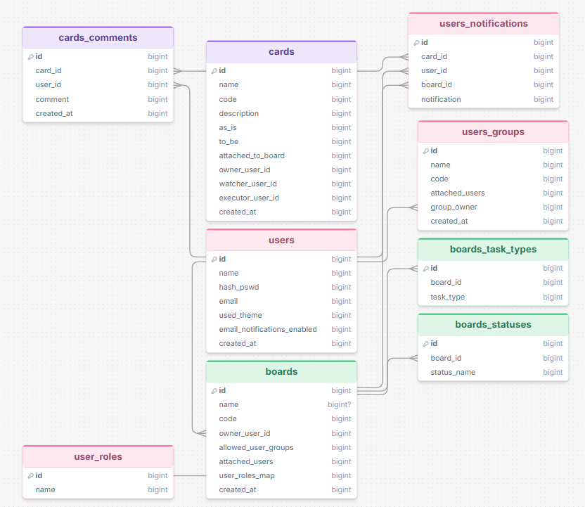
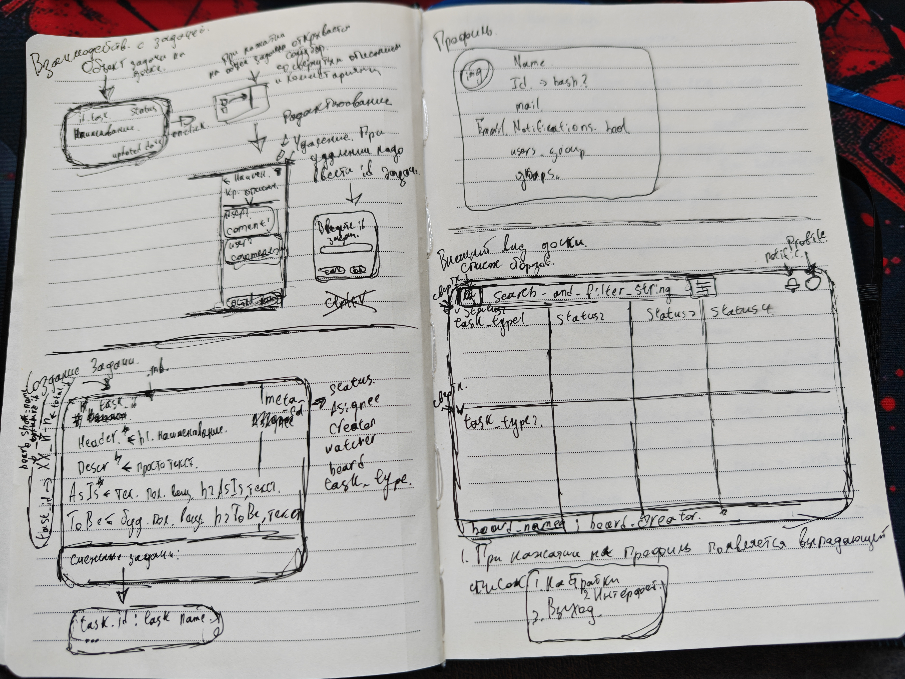
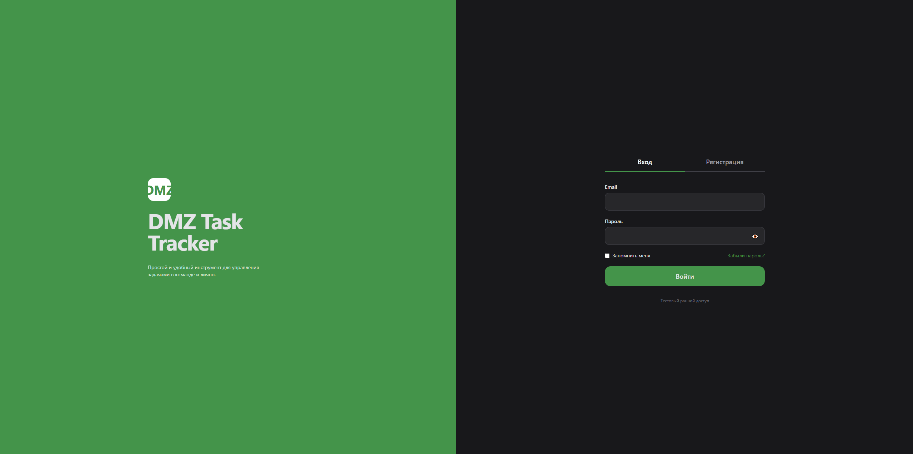

## Описание 

- Персональный локальный таск трекер

## Причина создания проекта

- мне было неудобно пользоваться ни корпоративным трекером, ни существующими на рынке открытыми решениями, ввиду чего решил написать свое

## Структура проекта

## ToDo

    3. Скрипт создани бд в соответствии с ее логической моделью

    4. Разработка главной страницы системы 
    4.1. Создать промежуточную страницу с логином/регистрацией. При регистрации запрашивать имя и email, отправлять на email код подтверждения регистрации
    4.2. Разработать механизм защиты от посещения сайта без регистрации / входа. Хранить в кукисах session_id вместе со сециальным токеном. при посещении страницы проверять их соответствие 
    4.3. В случае, если пользователь не прикреплен ни к какой группе, он должен создать группу / получить приглашение в существующую
    4.4. Если группа, в которой находится пользователь, располагает досками, он видит их на главной странице в качестве блоков
    4.5. В открытом виде каждая доска представлена в виде кликабельного блока. У пользователя есть возможность перейти на любую доску, к которой он имеет доступ, с главной страницы
    4.6. Дизайн главной страницы представлен в блоке 4 дизайн-проекта системы

    5. Разработка профиля пользователя 
    5.1. Сформировать профиль пользователя по умолчанию
    5.2. Добавить на страницу /user возможность менять имя, почту, настраивать уведомления и так далее
    5.3. Добавить возможность ставить свои фотографии в профиль
    5.4. При изменении почты профиля требуется отправлять email-письмо с кодом подтверждения сначала на старую, затем на новую почты

    6. Разработка интерфейса создания групп пользователей
    6.1. Каждый пользователь может пригласить другого пользователя по четко указанному email. Если пользователь зарегистрирован в системе он получает соответствующее уведомление
    6.2. Каждая группа имеет название и краткий тэг, состоящий из 2-х до 4-х символов. Допустимы буквы латиницы, цифры, нижние подчеркивания. Пользователь может видеть только те группы, в которых он состоит 
    6.3. В системе не может существовать несколько групп с одинаковым .lower названием
    6.4. Каждая группа имеет фиксированные роли пользователей. Владелец группы может изменять роли пользователей группы, в том числе назначить другого владельца группы

    7. Разработка интерфейса карточки задачи
    7.1.Каждая карточка имеет обязательные к заполнению в поля. В их число входят: заголовок (наименование), описание, AsIs, ToBe, автор, доска. Остальные поля (статус, исполнитель, наблюдатель, тип задачи не являются обязательными к заполнению)
    7.2. Каждая карточка задачи иимеет свой уникальный id, составленный по схеме: "XXX-n-q", где XXX - тэг доски, к которой эта задача принадлежит ; n - номер задачи на этой доске (инкремент) ; q - номер задачи в системе (инкремент)
    7.3. Любой пользователь, состоящий в группе, прикрепленной к доске, на которой находится задача, может оставить комментарий к задаче. Комментарий, в том числе, содержит ссылку на профиль пользователя, оставившего его 
    7.4. Внешний вилд карточки задачи представлен во втором блоке дизайн-проекта

    8. Разработка модуля отправки email
    8.1. Составление писем для регистрации, смены пароля, подтверждения приглашения
    8.2. Интеграция модуля в основную систему 

    9. ...

## Done 

    1. Проектировка БД системы 
    2. Проектировка модулей системы 

## Схемы

Здесь представлена текущая логическая модель бд. При будущих обновлениях она может подвергуться изменениям 

Система разделена на несколько модулей: 

    - Веб-интерфейс
    - API
    - Модуль взаимодействия с БД
    - Модуль отправки email-писем

Взаимодействие модулей системы не представляет из себя ничего сложного, ввиду чего не будет дополнительно описано

Дизайн-проект первой версии представлен на изображении ниже

## Реализованное

На текущий момент реализованы следующие модули веб-интерфейса: 

1. Странциа регистрации пользователя

